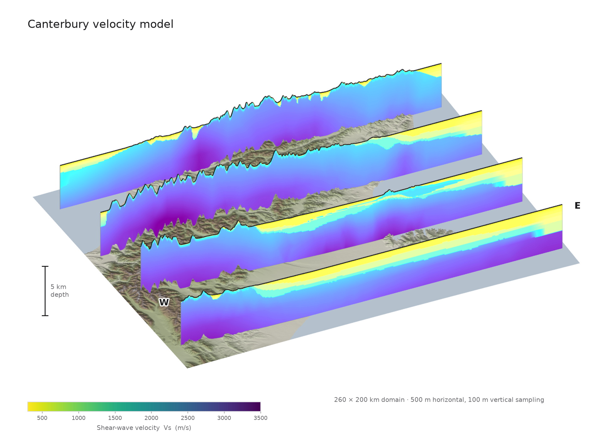
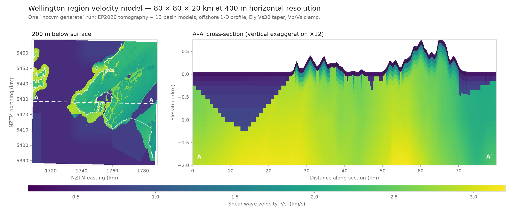

# NZCVM

New Zealand Community Velocity Model: tools for building and querying
tetrahedral velocity models.

A velocity model is a collection of tetrahedral meshes. Each mesh holds cell
data for seismic velocity (Vp, Vs), density (rho) and the quality factors
(Qp, Qs), plus a priority that controls blending where meshes overlap.
`nzcvm generate` samples those meshes onto a structured 3D grid. It then pushes
the result through a chain of layers and writes it in a format a simulation
code can read.



*One `nzcvm generate` run over a 260 × 200 km Canterbury domain. EP2020
tomography blended with fourteen basin and volcanic models, a 1-D offshore
profile, the Ely Vs30 taper, a Vp/Vs clamp, and Backus averaging over each
depth cell. The low-velocity wedge thickening eastward is the Canterbury
Plains sediment sequence. The high-Vs lens interrupting it on the second
section is the Banks Peninsula volcanics.*

---

## Build

The core query engine is a Rust extension built with
[setuptools-rust](https://github.com/PyO3/setuptools-rust). Requires Python
3.13 or newer.

`uv` is the preferred build tool for this repo:

```sh
uv sync   # creates a venv and builds the Rust extension
```

Or build and install the wheel by hand:

```sh
pip install build
python -m build --wheel
pip install dist/*.whl --force-reinstall
```

The extension compiles with the release profile by default. Set
`SETUPTOOLS_RUST_CARGO_PROFILE=dev` for debug builds.

### Non-pip dependencies

| Dependency              | Purpose                                           |
|-------------------------|---------------------------------------------------|
| Rust toolchain (stable) | Compiling the extension (if building from source) |
| HDF5 ≥ 1.12             | Needed at runtime by h5py                         |

`pyproject.toml` declares the Python dependencies. PyVista is an
optional visualisation dependency, needed only for `nzcvm view`:

```sh
pip install nzcvm[vis]   # also installs pyvista
```

---

## Quick start

```sh
uv run nzcvm generate examples/2014p240655.toml output.zarr
```

The config selects the grid, the layer chain, and the models to query. The
output extension selects the writer. The preceding example needs `resources/`
(DEM, Vs30, coastline) and `models/` to be present.

With no data to hand, build the synthetic dataset instead, then run against
it:

```sh
just synthetic
uv run nzcvm generate examples/synthetic.toml synthetic/model.zarr
```

---

## Command line

| Command              | Purpose                                                       |
|----------------------|---------------------------------------------------------------|
| `nzcvm generate`     | Generate a velocity model from a config file                  |
| `nzcvm view`         | Interactive 3D PyVista viewer for model output               |
| `nzcvm basin`        | Construct a tetrahedral mesh for a basin model                |
| `nzcvm tomography`   | Convert a CSV-like tomography model to a tetrahedral mesh     |
| `nzcvm surface`      | Convert an HDF5 topography surface to a VTK unstructured grid |
| `nzcvm convert-tiff` | Convert a GeoTIFF raster to a surface                         |
| `nzcvm tree-stats`   | Benchmark BVH query performance                               |
| `nzcvm synthetic`    | Write synthetic DEM, Vs30, basin, and tomography inputs       |

Useful `generate` options:

| Option           | Effect                                                          |
|------------------|-----------------------------------------------------------------|
| `--n-threads`    | Query threads (defaults to the process CPU affinity)            |
| `--format`       | Force an output format instead of inferring it from the path    |
| `--config-format`| Force `toml` / `yaml` / `json` instead of inferring             |
| `--quantise`     | ZFP-compress the arrays in NetCDF/Zarr output                   |
| `--distributed`  | Run on a local Dask distributed cluster                         |
| `--progress`     | tqdm progress bar (not compatible with `--distributed`)         |
| `--monitor`      | Log CPU/memory usage while running                              |
| `--log-level`    | `DEBUG` / `INFO` / `WARNING` (default `WARNING`)                |

---

## Configuration

A config is a TOML, YAML or JSON file with three sections: `metadata`, `grid`,
and an ordered list of `layers`. Config objects are plain dataclasses
deserialised by mashumaro, so you can also build them in pure Python. They
validate bounds, layer ordering, and layer dependencies.

### Grid types

Set by `grid.type`. All of them are topography-following and chunked lazily
with Dask.

| Type       | Key parameters                                                             |
|------------|-----------------------------------------------------------------------------|
| `sw4`      | `extent_x/y`, `refinements` (2:1 nested resolutions, ordered automatically) |
| `regular`  | `extent_x/y`, `thickness`, `resolution_x/y/z` (fixed vertical resolution)   |
| `emod3d`   | `nx`, `ny`, `nz`, `resolution`, `topo_type`                                 |
| `borehole` | `sites`, `depth`, `resolution_z` (one vertical profile per site)            |

Every grid takes `surface` (path to a DEM) and optional `[grid.chunks]`. The
three volumetric grids fill a rotated box, so they also take an
`[grid.orientation]` block naming the model origin of that box:

```toml
[grid.orientation]
crs = 'EPSG:2193'     # target projected CRS
azimuth = 39.0        # clockwise from north, degrees
origin_lon = 176.00145
origin_lat = -39.65225

[grid.chunks]
i = 256
j = 256
```

A `borehole` grid holds independent columns with no box to orient, so it takes
a bare `[grid.projection]` instead: just a CRS.

### Borehole grids

`grid.type = "borehole"` extracts one vertical profile per site rather than
filling a volume. Each column runs from the topography down to `depth` at a
fixed `resolution_z`, so the profiles line up sample for sample and compare
directly.

```toml
[grid]
type = "borehole"
surface = "./resources/dem.zarr"
depth = 600.0          # metres below the topography
resolution_z = 25.0    # metres between samples

[grid.projection]
crs = 'EPSG:2193'      # CRS the profiles are extracted in

[[grid.sites]]
longitude = 172.6218
latitude = -43.5283
site = "CACS"          # not a keyword; see below
network = "NZ"
```

Sites come in a global CRS (WGS84 unless `sites_crs` says otherwise), and the
builder maps them into `grid.projection.crs`. Instead of listing them inline,
point `sites` at a CSV or Parquet file with `longitude` and `latitude`
columns:

```toml
sites = "stations.csv"
```

Keep that line ahead of `[grid.projection]`: TOML would otherwise read it as
a key of that table.

#### Site labels

Longitude and latitude place a site, and the config reserves nothing else.
Every other key, and every other column of a site file, becomes a coordinate
on the grid's `i` axis under the name the caller gave it, and a column in
table output. Neither `site` nor `network` in the preceding example is a
keyword the grid interprets. Both end up in the output because nothing
reserves them. Rename them, add a driller's reference, drop them entirely: the
grid doesn't care.

A label keeps the type the caller wrote, so a numeric column arrives numeric.
Each site needs the same set of labels, since the alternative is a column of
nulls where one site was missing a key.

`nzcvm.grids.grid.RESERVED_COORDINATES` lists the names a label may not take:
the variables and attributes `GridSchema` declares (`x`, `y`, `z`, `depth`,
`name`, `geometry`, …), the `(i, j, k)` index, and the components a writer
puts alongside the grid. A coordinate shadows a variable of the same name, so
a label called `name` would turn `grid.name` from the grid's name into an
array. Naming one of those raises rather than corrupting the grid.

To drop the labels and keep only the spatial coordinates:

```toml
keep_extra_columns = false
```

The result has shape `(len(sites), 1, nk)`: one column per site, with `nk`
samples down each column. The singleton `j` axis preserves the `(i, j, k)`
contract every layer relies on. The site labels index the `i` axis, so the
output reads back per station:

```python
import xarray as xr

tree = xr.open_datatree("boreholes.zarr", engine="zarr")
grid = tree["grids/boreholes"].ds
vs = tree["qualities/boreholes"].ds.vs.squeeze("j")

for n, site in enumerate(grid.site.values):
    print(site, vs[n].values)
```

Writing to a `*.csv` or `*.parquet` path instead puts those labels in the
header, one row per sample:

```sh
uv run nzcvm generate examples/borehole.toml boreholes.csv
```

```
grid,site,network,i,j,k,x,y,z,depth,rho,vp,vs,qp,qs,alpha
boreholes,GULL,NZ,0,0,0,1531509.5,5161095.5,-641.124146,0,1810,1800.00012,500,100,50,1
boreholes,GULL,NZ,0,0,1,1531509.5,5161095.5,-616.124146,25,1810,1800,500,100,50,1
```

which `pandas` groups straight back into profiles:

```python
import pandas as pd

table = pd.read_csv("boreholes.csv")  # or read_parquet("boreholes.parquet")
for site, profile in table.groupby("site", sort=False):
    print(site, profile.vs.to_numpy())
```

`examples/borehole.toml` runs four profiles over the `just synthetic` dataset,
two of them inside a basin.

### Layers

Layers run in the order listed, outermost first. Each one delegates down the
chain, so the **last** entry must be `query`. Some layers declare
dependencies: `ely` and `offshore` both need the `coastline` coordinate, so a
`coastline` layer has to appear before them. The config raises a validation
error if a dependency is missing.

| Type        | Description                                                             |
|-------------|--------------------------------------------------------------------------|
| `query`     | Queries the tetrahedral model tree (required, and always last)          |
| `ely`       | Ely et al. (2010) near-surface Vs taper from a Vs30 map                 |
| `offshore`  | 1-D offshore/coastal velocity profile (requires `coastline`)            |
| `coastline` | Computes signed distance to the coastline, provides `coastline`         |
| `clamp`     | Clamps components and the Vp/Vs ratio to physical bounds                |
| `backus`    | Alpha-weighted super-sampling over each depth cell                     |
| custom      | Any layer registered with `@functional_layer` or as a `Layer` subclass  |

### Output formats

Inferred from the output path, or forced with `--format`.

| Format   | Path      | Description                                                     |
|----------|-----------|-----------------------------------------------------------------|
| `zarr`   | `*.zarr`  | Chunked array store, keeps all metadata, good for debugging     |
| `netcdf` | `*.h5`    | NetCDF4/HDF5 via xarray                                         |
| `sfile`  | `*.sfile` | sfile HDF5 format for driving [SW4](github.com/geodynamics/sw4) |
| `emod3d` | directory | `rho3dfile.d`, `vp3dfile.p`, `vs3dfile.s` binaries suitable for driving [EMOD3D](https://doi.org/10.1785/BSSA0860041091)              |
| `csv`     | `*.csv`   | Flat table, one row per point, labelled by grid, and by site   |
| `parquet` | `*.parquet`, `*.pq` | The same table, with the float32 columns kept typed |

`csv` and `parquet` share one flattening step, so the columns are the same
either way. Both hold the whole table in memory, which suits the outputs a
person reads: boreholes, transects, a few profiles. Volumetric grids belong in
Zarr or NetCDF.

### Example configuration

See `examples/` for complete, working configs:

| File                          | Shows                                              |
|-------------------------------|-----------------------------------------------------|
| `2014p240655.toml`            | SW4 grid, full layer chain                          |
| `2014p240655_emod3d.toml`     | The same domain as an EMOD3D grid                   |
| `whole_country.toml`          | `regular` grid over New Zealand                     |
| `near_fault_config.toml`      | A custom layer (`examples/near_fault.py`) in a config |
| `synthetic.toml`              | The same chain over the `just synthetic` dataset    |
| `borehole.toml`               | `borehole` grid: profiles at four sites             |

```toml
[metadata]
title = "Domain for geonet event 2014p240655"

[grid]
type = "sw4"
surface = "./resources/dem.zarr"
extent_x = 210000.0
extent_y = 330000.0

[grid.orientation]
crs = 'EPSG:2193'
azimuth = 39.0
origin_lon = 176.00145
origin_lat = -39.65225

[grid.refinements.top_layer]
resolution = 200.0
bottom = 5000.0     # bottom elevation, +z down

[[layers]]
type = "clamp"
min_vp_vs_ratio = 1.73
max_vp_vs_ratio = 4.0

[[layers]]
type = "coastline"
coastline = "resources/coastline.wkb.gz"

[[layers]]
type = "ely"
vs30 = "./resources/vs30.zarr"
depth_t = 450.0

[[layers]]
type = "query"
model_path = "./models"
model_globs = ["*.zarr"]
```

---

## Reading the output

Zarr and NetCDF output is a standard xarray `DataTree` with two top-level
groups, each with one node per grid:

```
/
├── grids/<name>       x, y, z, depth   (i, j, k)
└── qualities/<name>   vp, vs, rho, qp, qs, alpha   (i, j, k)
```

`x`, `y`, `z` and `depth` are *data variables* on the logical `(i, j, k)`
index, not dimension coordinates. The grid is curvilinear, so every point
carries its own position.

```python
import matplotlib.pyplot as plt
import xarray as xr

dt = xr.open_datatree("output.zarr", engine="zarr")
grid = dt["grids/grid"].ds
qual = dt["qualities/grid"].ds

# Horizontal Vs slice 200 m down (k = 2 at 100 m vertical spacing)
plt.pcolormesh(grid.x[:, :, 2], grid.y[:, :, 2], qual.vs[:, :, 2])

# West–east vertical cross-section at j = 100
plt.pcolormesh(grid.x[:, 100, :], -grid.z[:, 100, :], qual.vs[:, 100, :])
```

This block generates a depth slice and a cross-section through an 80 × 80 × 20
km Wellington domain at 400 m horizontal resolution. Both sit high in the
section because the Wellington basins are shallow: the low-velocity cap runs
100 to 400 m thick over most of the domain, so a slice at 500 m cuts almost
entirely below it.



For interactive 3D visualisation with PyVista (requires `nzcvm[vis]`):

```sh
nzcvm view model output.zarr --scalar vs --coastline resources/coastline.wkb.gz
```

`nzcvm view model` also diffs two models (`--compare-to`, `--diff-mode`) and
can render off-screen to an image file (`--off-screen --screenshot out.png`).

---

## Python API

Query a model tree directly, without building a grid:

```python
from pathlib import Path
from nzcvm.models.model import ModelTree

tree = ModelTree.load_models(
    [Path("models/ep2020.zarr"), Path("models/Wellington.zarr")]
)
quality = tree.query(x=1_749_150.0, y=5_428_150.0, z=500.0)
print(quality.vp, quality.vs)  # None if the point is outside every mesh
```

`load_models` takes an iterable of mesh paths, anything `xarray` can open
(the meshes distributed in `models/` are Zarr). Coordinates are in the model's
projected CRS with `z` positive downwards.

`query_many` is the vectorised form and returns a `Qualities` dataset.
`explain` shows which models contributed to the blend:

```python
>>> tree.explain(1_749_150.0, 5_428_150.0, 100.0)
(ρ=1810.00, Vp=1800.00, Vs=580.00, Qp=58.00, Qs=29.00, ɑ=1.00)
├── Model 0 (priority = 38)
│   └── Quality: (ρ=1810.00, Vp=1800.00, Vs=580.00, ...)
└── Model 1 (priority = 255)
    └── Quality: (ρ=2539.03, Vp=4564.84, Vs=2630.92, ...)
```

Lower priority numbers win. Overlapping models are alpha-composited until the
cumulative alpha reaches 1.0. `ModelRange` restricts a query by priority band:
`BASINS` is 0-127, `TOMOGRAPHY` is 128-255, `ALL` is both.

---

## Testing

```sh
uv run pytest tests/
uv run pytest --doctest-modules nzcvm/   # doctests
uv run ruff check nzcvm/ tests/          # linting
uv run ty check nzcvm/                   # type checking
```

Tests marked `real_data` need a model directory supplied via `MODEL_PATH`.

### Synthetic data

`just synthetic` writes a self-contained data root under `synthetic/`, so a
run of `nzcvm generate` covers the whole path without the real NZCVM data. It
takes about a minute, most of it meshing the basins, and needs no
`NZCVM_DATA_ROOT`.

| Recipe                 | Writes                                                     |
|------------------------|------------------------------------------------------------|
| `synthetic_dem`        | `dem.h5`, `dem.zarr` (topography for `grid.surface`)       |
| `synthetic_vs30`       | `vs30.h5`, `vs30.zarr` (Vs30 map for the `ely` layer)      |
| `synthetic_coastline`  | `coastline.wkb.gz` (land polygon in NZTM)                  |
| `synthetic_tomography` | `models/tomography.zarr` (background tomography mesh)      |
| `synthetic_basins`     | `models/gully.zarr`, `models/terrace.zarr`                 |
| `clean_synthetic`      | Removes the lot                                            |

Every field is a closed-form expression over a 48 × 44 km patch of coast, so
the data regenerates identically anywhere and a test can work out the expected
answer by hand. `nzcvm/synthetic.py` documents the world. Elevation falls west
to east and crosses sea level three quarters of the way across, and Vs30
tracks elevation. A pair of paraboloid basins sit inland, over a tomography
block whose velocity increases with depth.

The pieces are importable, so a test can use a field directly rather than
going through a file:

```python
from nzcvm import synthetic

synthetic.elevation(172.0, -43.6)  # 550.0 m above sea level, inland
synthetic.vs30(172.6, -43.6)  # 200.0 m/s, offshore
```

---

## Code architecture

Four subpackages, each with a narrow responsibility.

### `nzcvm.models`

Geospatial Rust wrappers and mesh I/O. `MeshModel` wraps one tetrahedral
mesh. `ModelTree` combines many meshes into a priority-ordered BVH tree and
handles alpha-composited queries. `Surface` interpolates values from a 2-D
triangular surface mesh (used for the DEM and the Vs30 map). `mesh` provides
the tetrahedral and structured mesh dataclasses and their I/O.

### `nzcvm.layers`

A `Layer` accepts a `Grid` (an xarray Dataset of 3D coordinates) and a
`ModelRange`, and returns `Qualities`. Layers chain via constructor injection
(`next_layer`), and register themselves against a config class through an
`__init_subclass__` hook on `Layer`.

Built-in layers: `QueryLayer`, `ElyLayer`, `OffshoreBasinLayer`,
`CoastlineLayer`, `ClampLayer`, `BackusAveragedLayer`.

`build_pipeline` assembles the chain from a config list, and
`execute_model_pipeline` applies it to every grid with one `map_blocks` per
grid. That hoists the chunked dispatch out of the layers: each layer always
receives a fully concrete chunk and can use plain NumPy.

### `nzcvm.config`

Grid and layer configuration. Each layer comes with a companion `LayerConfig`
dataclass and each grid with a companion `GridConfig`, dispatched on the `type`
discriminator. `VelocityModelConfig` is the top-level object and validates
layer ordering and dependencies.

### `nzcvm.grids`

Builds 3D curvilinear meshes (`sw4`, `regular` or `emod3d`) as xarray
`DataTree` nodes, chunked lazily with Dask and assembled from a `GridConfig`
by the `build_grids_from_config` single-dispatch function.

`Qualities` (in `nzcvm.qualities`) is an `xr.Dataset` subclass carrying the
typed velocity, density and quality-factor arrays returned by every layer.

---

## Extending with custom grids and layers

Both grids and layers are extension points.

### Functional layers (simple case)

The `@functional_layer` decorator turns a plain function into a registered
layer, generating a matching `LayerConfig` from its keyword parameters.

```python
from nzcvm.grids.grid import Grid
from nzcvm.layers.core import Layer
from nzcvm.layers.functional import functional_layer
from nzcvm.query import ModelRange


@functional_layer
def scale_vs(
    grid: Grid,
    model_range: ModelRange = ModelRange.ALL,
    *,
    next_layer: Layer,
    factor: float = 1.0,
):
    """Multiply Vs throughout the model by *factor*."""
    qualities = next_layer(grid, model_range)
    qualities["vs"] = qualities["vs"] * factor
    return qualities
```

Add it to a config:

```toml
[[layers]]
type = "scale_vs"
factor = 0.9
```

See `examples/near_fault.py` for a fuller example that uses a spatial distance
mask to perturb Vs near a fault zone.

### Class-based layers

For layers that need state, caching, or a non-trivial config, subclass `Layer`
and pass a matching `LayerConfig` via the `config_cls` keyword. A layer's
`__init__` receives `(config, geometry, next_layer)`. The `geometry` is the
domain footprint, useful for pruning resources at construction time.

```python
from dataclasses import dataclass

import numpy as np
from shapely import Geometry

from nzcvm.config.layers.core import LayerConfig
from nzcvm.grids.grid import Grid
from nzcvm.layers.core import Layer
from nzcvm.qualities import Qualities
from nzcvm.query import ModelRange


@dataclass
class DepthFloorConfig(LayerConfig):
    """Raise Vs to a floor that grows linearly with depth."""

    surface_floor: float = 500.0
    gradient: float = 0.05  # m/s of floor per metre of depth
    type: str = "depth_floor"


class DepthFloorLayer(Layer[DepthFloorConfig], config_cls=DepthFloorConfig):
    def __init__(
        self, config: DepthFloorConfig, geometry: Geometry, next_layer: Layer
    ) -> None:
        super().__init__(config, geometry, next_layer)

    def __call__(
        self, grid: Grid, model_range: ModelRange = ModelRange.ALL
    ) -> Qualities:
        qualities = self.next_layer(grid, model_range)
        floor = self.config.surface_floor + self.config.gradient * grid.depth
        qualities["vs"] = np.maximum(qualities["vs"], floor)
        return qualities
```

Use it in TOML:

```toml
[[layers]]
type = "depth_floor"
surface_floor = 500.0
gradient = 0.05
```

Importing the module registers the layer, so import it before decoding the
config.

### Custom grid types

A grid is an xarray Dataset built through `GridSchema`, which fixes the
contract every layer relies on: `x`, `y`, `z` and `depth` on the logical
`(i, j, k)` index (metres, projected CRS, `z` positive down), plus the
attributes below.

Those four variables and the attributes are the whole of what `GridSchema`
accepts, so a builder can't pass an extra *data variable*. It can attach extra
*coordinates* after construction, though, and every stage keeps them: layers,
`map_blocks`, the Zarr and NetCDF writers, and the read back through
`GridSchema.from_dataset`. xarray keeps a coordinate on each data variable it
indexes, so anything that reassembles a dataset from those variables picks it
up again. The borehole grid labels its columns this way:

```python
grid = grid.assign_coords(site=("i", ["GULL", "TERR"]))
```

The name must avoid `RESERVED_COORDINATES`, since a coordinate shadows a
variable or attribute of the same name. The `csv` and `parquet` writers turn
any coordinate outside the contract into a label column.

Here is a transect: a line of vertical columns between two
points, shaped `(n, 1, nk)`.

```python
import numpy as np
import shapely

from nzcvm.grids.grid import Grid, GridSchema


def transect_grid(
    start: tuple[float, float],
    end: tuple[float, float],
    n: int,
    bottom: float,
    dz: float,
) -> Grid:
    """A line of vertical columns of query points, sampled at *n* stations."""
    depth = np.arange(0.0, bottom, dz, dtype=np.float32)
    along = np.linspace(0.0, 1.0, n, dtype=np.float32)
    x = start[0] + along * (end[0] - start[0])
    y = start[1] + along * (end[1] - start[1])

    # Broadcast the (n,) line and the (nk,) depths into (n, 1, nk).
    x, _ = np.meshgrid(x, depth, indexing="ij")
    y, depth = np.meshgrid(y, depth, indexing="ij")
    x, y, depth = (array[:, np.newaxis, :] for array in (x, y, depth))

    return GridSchema.new(
        x=x,
        y=y,
        z=depth,
        depth=depth,
        name="transect",
        resolution=dz,
        geometry=shapely.LineString([start, end]),
        origin_lon=np.float32(174.7762),
        origin_lat=np.float32(-41.2865),
        azimuth=np.float32(0.0),
        grid_azimuth=np.float32(0.0),
        bottom_left_lon=np.float32(174.7762),
        bottom_left_lat=np.float32(-41.2865),
    )
```

Pass the result straight to a pipeline:

```python
from pathlib import Path

from nzcvm.config.layers.query import QueryLayerConfig
from nzcvm.layers.pipeline import build_pipeline

grid = transect_grid(
    start=(1_749_150.0, 5_428_150.0),
    end=(1_759_150.0, 5_428_150.0),
    n=3,
    bottom=500.0,
    dz=100.0,
)
pipeline = build_pipeline(
    grid.geometry,
    [QueryLayerConfig(model_path=Path("models"), model_globs=["*.zarr"])],
)
qualities = pipeline(grid)
print(qualities.vs.values[0].ravel())  # Vs down the first column, in m/s
```

To drive a grid from a config file, register a builder against a `GridConfig`
subclass. `build_grids_from_config` is a `functools.singledispatch` function
returning a `dict[str, Grid]`. One entry per grid, since an SW4 domain
produces one mesh per refinement level.

```python
from dataclasses import dataclass
from typing import Literal

from nzcvm.config.grids import GridConfig
from nzcvm.grids.builder import build_grids_from_config
from nzcvm.grids.grid import Grid


@dataclass
class TransectConfig(GridConfig):
    start: tuple[float, float]
    end: tuple[float, float]
    n: int
    bottom: float
    dz: float
    type: Literal["transect"] = "transect"


@build_grids_from_config.register
def _(config: TransectConfig) -> dict[str, Grid]:
    return {
        "transect": transect_grid(
            config.start, config.end, config.n, config.bottom, config.dz
        )
    }
```

Which makes this config valid:

```toml
[grid]
type = "transect"
start = [1749150.0, 5428150.0]
end = [1759150.0, 5428150.0]
n = 3
bottom = 500.0
dz = 100.0
```

`nzcvm.grids.borehole` is the same pattern, done properly: a registered
`GridConfig` whose builder reads its own sites and DEM, over Dask-backed
coordinates.
